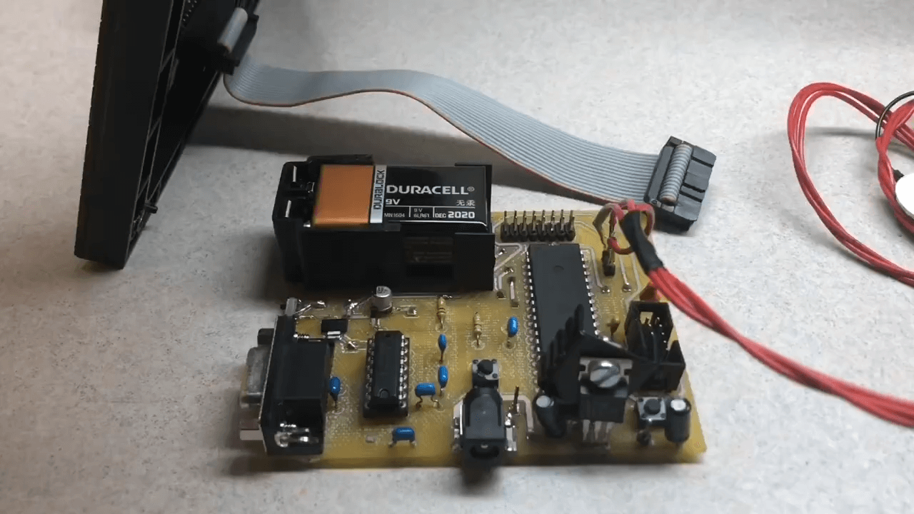

## Muscle Sensor LED Display
This micro-controller project measures muscle contractions and displays it on a 32x32 LED screen. The harder you contract your muscle, the larger the wave! Any large enough muscle is compatible, such as the biceps, forearms, or even forehead muscles!
Check out my [youtube video](https://youtu.be/R8VW5WCSrXk) for some step-by-step installation instructions. 👌

## Motivation
Using adafruit's libraries, the slowest processor that can adequately run the [SPX-14633 32x32 matrix](https://sparkfun.com/products/14633) is 16MHz. By avoiding the libraries and driving each pin directly, as this code demonstrates, the LED matrix can adequately be driven on the 1 MHz processor of the atmega164p. 

## Code
The micro-controller C code does not use any libraries, besides avr/io.

## Materials
The schematic and board files were designed for the Atmega164p and the SPX-14633 32x32 LED screen. Another microcontroller can be used, and this schematic should make a good reference. Because of the fast clock and refresh rate needed to drive the 32x32 LED screen, I would  recommend using a micro controller with a 1 MHz processor and higher. An optional RS-232 serial interface is included for debugging and JTAG interface for on-board programming of the Atmega 164P.

Muscle Sensor:
* [MyoWare Muscle Sensor  ($37.95)](https://www.adafruit.com/product/2699)
* [Surface EMG Electrodes ($4.95)](https://adafruit.com/product/2773)
* 1x3 Pinhead

Micro-controller:
* [Atmega164p ($3.79)](https://microchip.com/wwwproducts/en/ATmega164P)

LED Panel:
* [32x32 LED Panel- 1:8 scan rate ($14.95)](https://sparkfun.com/products/14633)
* 2x8 pinhead

UART Debugging (optional):
* RS-232 serial interface
* Max232            

On-board Programming (optional):
* Any JTAG programmer to program micro controller
* 2x5 pinhead

Power:
* 7805 voltage regulator
* 9-Volt battery
* Barrel connector

Other (see schematic):
* 2 Buttons
* Several 0.1 μF capacitors
* Several resistors

## Installation Help
* [Myoware muscle sensor set-up](https://learn.adafruit.com/getting-started-with-myoware-muscle-sensor)
* [Matrix hook-up guide](https://learn.sparkfun.com/tutorials/rgb-panel-hookup-guide)

## How it works
* [1:8 Scan rate panels](https://www.sparkfun.com/sparkx/blog/2650)

## Images

#### Wrist Demo

 

#### Physcial Board

 

#### Schematic

 

#### Board Design

 

